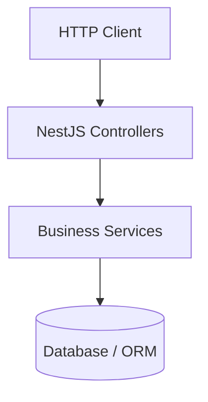

# Getting Started Concept

This concept guide introduces the general architectural boundaries and core technologies used in this application.

## High-Level Flow

## Architectural Guidelines

1. **Modules**: Write codebase features modularly under `src/modules/<feature_name>/`. Each folder should group its `.module.ts`, `.controller.ts`, and `.service.ts`.
2. **Auto-Wiring**: Ensure modules are exported and registered properly. Dynamic module aggregations are kept under the `src/generated.*.ts` files, which are managed by the CLI.
3. **Documentation**: When adding a new feature or endpoint, run `npm run docs:sync` to rebuild the documentation structure. If the feature introduces new business rules, write a conceptual note under `docs/concepts/` and link it in `docs/_MAP.md`.
